# 🚀 AWS EC2 Auto Scaling, ALB & CloudWatch Monitoring Project


---

**👤 Author:** [Mahesh Shukla](http://linkedin.com/in/maheshsh)  
**🎯 Goal:** Design a **highly available, scalable, and monitored web infrastructure** using **AWS EC2**, **EBS**, **AMI**, **Launch Templates**, **Auto Scaling Groups (ASG)**, **Application Load Balancer (ALB)**, and **CloudWatch**.  
**🕒 Duration:** Day 3 of AWS DevSecOps Journey  
**⚙️ Focus:** *Automation · High Availability · Monitoring*

---

## 📚 Table of Contents

1. [Project Overview](#-project-overview)
2. [Architecture Overview](#-architecture-overview)
3. [Pre-requisites](#-pre-requisites)
4. [Step-by-Step Implementation](#️-step-by-step-implementation)
5. [Verification Checklist](#-verification-checklist)
6. [Key Learnings](#-key-learnings)
7. [Troubleshooting](#-troubleshooting)
8. [Cost Awareness](#-cost-awareness)
9. [Future Enhancements](#-future-enhancements)
10. [Tech Stack](#-tech-stack)
11. [Author](#-author)

---

## 🧭 Project Overview

This project showcases a **scalable and monitored web application deployment** using core AWS services. It demonstrates automation, elasticity, fault tolerance, and observability — the building blocks of cloud-native architecture.

### 🎯 Key Objectives
- Configure persistent storage with **EBS**  
- Automate deployments via **Launch Templates** and **User Data**  
- Achieve horizontal scalability using **Auto Scaling Groups (ASG)**  
- Load balance traffic via **Application Load Balancer (ALB)**  
- Implement proactive monitoring with **CloudWatch Alarms**

---

## 🧱 Architecture Overview

### 🏗️ Components

| Component | Description |
|------------|-------------|
| **EC2 Instance** | Hosts the Apache web server |
| **EBS Volume** | Provides persistent block-level storage |
| **AMI** | Golden image for instance replication |
| **Launch Template** | Defines configuration for ASG |
| **Auto Scaling Group** | Maintains capacity and scales automatically |
| **Application Load Balancer (ALB)** | Distributes incoming HTTP traffic |
| **CloudWatch** | Monitors performance metrics and triggers alarms |

📘 **Reference:** [AWS Architecture Center](https://aws.amazon.com/architecture/)

---

### 🧩 Architecture Diagram (Mermaid)

```mermaid
%% AWS Architecture - Colorful Scalable Web Infrastructure

flowchart TD
    %% Users
    User["🌐 User / Browser"] -->|HTTP Requests| ALB["⚡ Application Load Balancer (HTTP)"]

    %% EC2 Instances under ASG
    subgraph ASG["🖥️ Auto Scaling Group"]
        direction TB
        EC21["EC2 Instance 1\nWeb Server (Apache)\nUser Data Script"]
        EC22["EC2 Instance 2\nWeb Server (Apache)\nUser Data Script"]
    end

    %% Load Balancer to EC2
    ALB --> EC21
    ALB --> EC22

    %% EBS Volumes
    EC21 --> EBS1["💾 EBS Volume (Persistent)"]
    EC22 --> EBS2["💾 EBS Volume (Persistent)"]

    %% CloudWatch Monitoring
    EC21 --> CW["📊 CloudWatch\nCPU, Health Checks, Alarms"]
    EC22 --> CW

    %% Launch Template wraps ASG
    subgraph LT["📝 Launch Template"]
        ASG
    end

    %% AMI wraps Launch Template
    subgraph AMI["🛠️ Custom AMI"]
        LT
    end

    %% Color styling with black text
    classDef userNode fill:#FFD700,stroke:#333,stroke-width:1px,rx:5,ry:5,color:#000000;      %% Gold
    classDef albNode fill:#FF8C00,stroke:#333,stroke-width:1px,rx:5,ry:5,color:#000000;       %% Dark Orange
    classDef ec2Node fill:#1E90FF,stroke:#333,stroke-width:1px,rx:5,ry:5,color:#000000;       %% Dodger Blue
    classDef ebsNode fill:#32CD32,stroke:#333,stroke-width:1px,rx:5,ry:5,color:#000000;       %% Lime Green
    classDef cwNode fill:#8A2BE2,stroke:#333,stroke-width:1px,rx:5,ry:5,color:#000000;        %% Blue Violet
    classDef asgNode fill:#00CED1,stroke:#333,stroke-width:1px,rx:5,ry:5,color:#000000;       %% Dark Turquoise
    classDef ltNode fill:#FF69B4,stroke:#333,stroke-width:1px,rx:5,ry:5,color:#000000;        %% Hot Pink
    classDef amiNode fill:#FF4500,stroke:#333,stroke-width:1px,rx:5,ry:5,color:#000000;       %% Orange Red

    %% Apply classes
    class User userNode;
    class ALB albNode;
    class EC21,EC22 ec2Node;
    class EBS1,EBS2 ebsNode;
    class CW cwNode;
    class ASG asgNode;
    class LT ltNode;
    class AMI amiNode;
```



📸 **Screenshot:**  
  
*Figure: Logical flow of traffic and scaling events within AWS architecture.*

---

## 🧰 Pre-requisites

Before starting, ensure the following:

- ✅ AWS Account (Free Tier eligible)  
- ✅ IAM User with `EC2`, `ALB`, and `CloudWatch` permissions  
- ✅ SSH Key Pair for EC2 access  
- ✅ Installed: [AWS CLI](https://docs.aws.amazon.com/cli/latest/userguide/getting-started-install.html)  
- ✅ Basic knowledge of Linux commands and AWS Console  

---

## 🏗️ Step-by-Step Implementation

### ⚙️ Step 1: Launch EC2 Instance

```bash
ssh -i aws-day3-key.pem ec2-user@<EC2-Public-IP>
sudo yum update -y
sudo yum install httpd -y
sudo systemctl start httpd
sudo systemctl enable httpd
echo "<h1>Hello from Mahesh EC2 Webserver</h1>" | sudo tee /var/www/html/index.html
```

📸 **Screenshots:**  
  


---

### 💾 Step 2: Attach and Mount EBS Volume

```bash
lsblk
sudo mkfs -t xfs /dev/xvdf
sudo mkdir /data
sudo mount /dev/xvdf /data
df -h
echo "/dev/xvdf /data xfs defaults,nofail 0 2" | sudo tee -a /etc/fstab
sudo reboot
df -h
```

📸 **Screenshots:**  
  


---

### 🧬 Step 3: Create a Custom AMI

```bash
aws ec2 create-image --instance-id <instance-id> --name "webserver-ami-day3" --no-reboot
```

📸 **Screenshot:**  


---

### 📝 Step 4: Create a Launch Template

```bash
#!/bin/bash
yum update -y
yum install -y httpd stress
systemctl start httpd
systemctl enable httpd
echo "<h1>Auto Scaling Instance - $(hostname)</h1>" > /var/www/html/index.html
```

📸 **Screenshot:**  


---

### ⚖️ Step 5: Configure Application Load Balancer (ALB)

1. Create a **Target Group** (HTTP on port 80).  
2. Create an **Application Load Balancer** and attach it to the Target Group.  
3. Enable health checks to ensure instance availability.

📸 **Screenshot:**  


---

### 🔁 Step 6: Configure Auto Scaling Group (ASG)

| Setting | Value |
|----------|--------|
| Desired Capacity | 2 |
| Minimum Instances | 1 |
| Maximum Instances | 3 |
| Health Check Type | ELB + EC2 |

📸 **Screenshot:**  


---

### 📊 Step 7: CloudWatch Monitoring & Alarms

Use `stress` to simulate CPU load and trigger scaling actions.

```bash
sudo yum install stress -y
stress --cpu 2 --timeout 300
```

📸 **Screenshot:**  


---

### 🌐 Step 8: Test Load Balancer

Access your application via ALB DNS:

```bash
http://<ALB-DNS-Name>
```

📸 **Screenshot:**  


---

## ✅ Verification Checklist

| Step | Description | Status |
|------|--------------|--------|
| 1 | EC2 + Web Server | ✅ |
| 2 | EBS Attached | ✅ |
| 3 | Custom AMI | ✅ |
| 4 | Launch Template | ✅ |
| 5 | ALB Configured | ✅ |
| 6 | ASG Active | ✅ |
| 7 | CloudWatch Alarm | ✅ |
| 8 | ALB Tested | ✅ |

---

## 💡 Key Learnings

- Persistent storage via **EBS volumes**  
- Infrastructure automation using **Launch Templates**  
- Dynamic scalability with **Auto Scaling Groups**  
- Fault-tolerant traffic management via **ALB**  
- Monitoring and alerting using **CloudWatch Metrics & Alarms**

---

## 🧩 Troubleshooting

| Issue | Cause | Solution |
|-------|--------|-----------|
| Web page not loading | Security Group missing HTTP rule | Add inbound port 80 rule |
| Volume not persistent | Missing `/etc/fstab` entry | Re-add mount entry and reboot |
| ALB health check failing | Apache service stopped | Restart `httpd` and verify health check URL |

---

## 💰 Cost Awareness

- 🧹 Terminate unused instances to avoid charges  
- 💡 Use Free Tier instances like `t2.micro` or `t3.micro`  
- 📊 Monitor spending via [AWS Cost Explorer](https://aws.amazon.com/aws-cost-management/)  

> ⚠️ **Tip:** Always delete ALB and ASG resources after testing — they continue billing even if EC2 instances are terminated.

---

## 🔮 Future Enhancements

- [ ] Enable HTTPS via **AWS Certificate Manager (ACM)**  
- [ ] Add **CloudWatch Dashboards** for visual metrics  
- [ ] Automate infrastructure using **Terraform**  
- [ ] Implement **CI/CD pipeline** (CodePipeline + CodeDeploy)  
- [ ] Add **SNS Notifications** for scaling events  

---

## 🧑‍💻 Author

**Mahesh Shukla**  
_Aspiring AWS DevSecOps Engineer_  
📍 Mumbai, India  
🔗 [LinkedIn](https://www.linkedin.com/in/maheshshukla01/)

> _“Scaling is not a feature — it’s a mindset.  
> Monitor everything. Automate everything.”_

---

## 🧰 Tech Stack

| Category | Technologies |
|-----------|---------------|
| **Cloud Provider** | AWS (EC2, EBS, ALB, ASG, CloudWatch) |
| **Operating System** | Amazon Linux 2 |
| **Automation** | AWS CLI, Bash Scripts |
| **Monitoring** | AWS CloudWatch |
| **Security** | IAM, Security Groups |
| **DevOps Tools** | GitHub, DevSecOps Principles |

---

📄 *This README is optimized for GitHub presentation — with badges, tables, and diagrams for portfolio visibility.*
